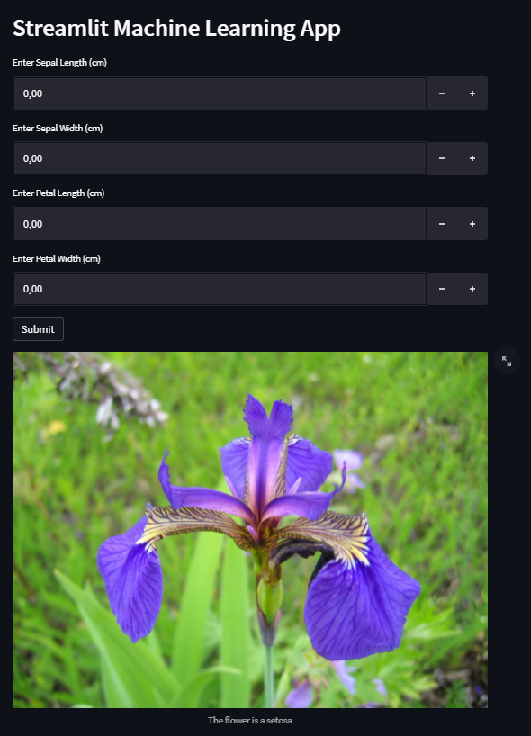

# Iris Machine Learning Repository
This repository is to lear how to use some friendly code tools for doing machine learning repositories.
This is doing using the classic iris dataset in order to give an example.


## Project requirements
* Python 3.x (the project was developed using python 3.8)
* virtualenv installed (associated with you py3 installation)
* pip installed (associated with you py3 installation)

## Local installation
Clone the project
```bash
git clone https://gitlab.com/FZENTRA94/iris_ml_repo.git
```
Create virtual environment:
```bash
virtualenv venv
```
Activate the virtual environment:
```bash
venv/Scripts/activate
```
Packages installation with pip:
```bash
pip install -r requirements.txt
```
For create all directories:
```bash
python configs.py
```

## Google Cloud Platform - Service Account


## Environments variables
Copy the file `.env.example` and change the name to `.env` and fill with the respective credentials, where
`GCP_CRED_PATH` is the path of the [Google Cloud Platform Service Account Key](https://cloud.google.com/iam/docs/creating-managing-service-account-keys) and `GCP_PROJECT_ID` the name of the project 
where you will work.

## Getting Started
Run all tests
```bash
python -m unittest discover -s tests  -p '__*.py' 
```

Open the terminal in you machine and run the following command to access the web application in your localhost.
```bash
streamlit run app.py
```

You are ready! and you will have something like this:

 